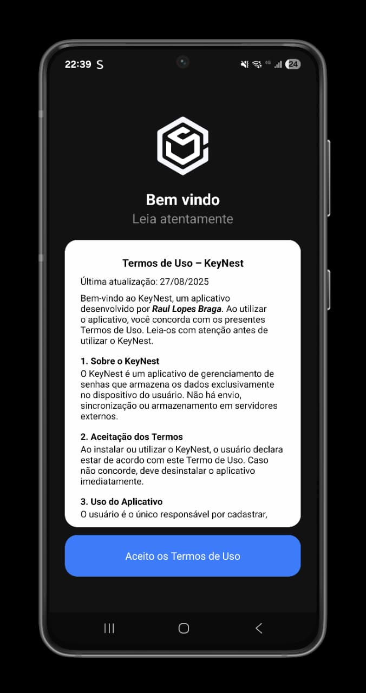
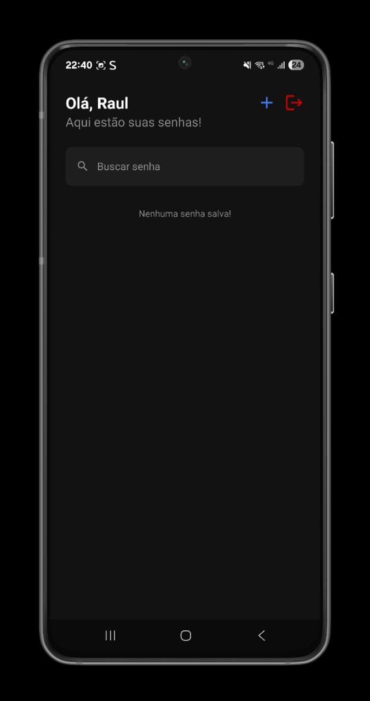
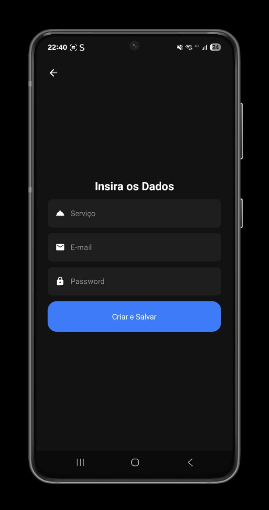
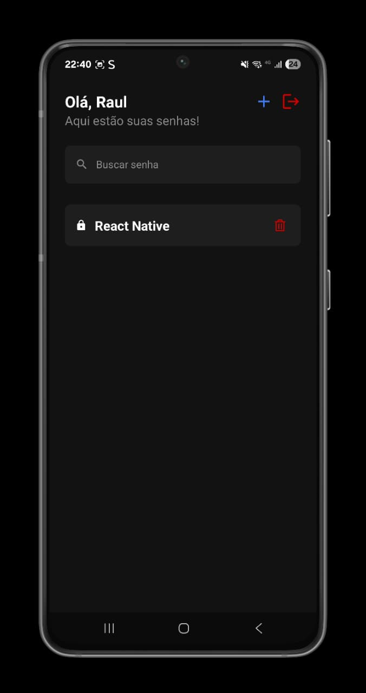
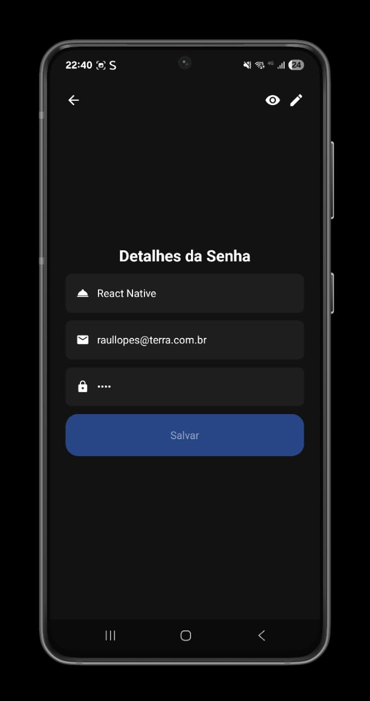

# KeyNest

<p align="center">
  
  
  
  
  
</p>
KeyNest é um aplicativo de gerenciamento de senhas que armazena seus dados de forma segura e exclusivamente no seu dispositivo. Não há sincronização ou envio para servidores externos, garantindo privacidade total.

## Funcionalidades

- **Armazenamento local de senhas**  
  Suas senhas ficam salvas apenas no seu aparelho, usando [`itemsStorage`](src/storage/itemsStorage.ts).
- **Autenticação biométrica**  
  Protege o acesso ao app utilizando autenticação local via biometria.
- **Busca e gerenciamento**  
  Pesquise, edite, remova e adicione novas senhas facilmente.
- **Termos de uso**  
  O app exige aceitação dos termos antes do uso, gerenciado por [`authStorage`](src/storage/authStorage.ts).

## Estrutura do Projeto

- Telas principais:  
  - Home: Lista de senhas ([`Home`](src/app/screens/Home/index.tsx))
  - Nova senha: Cadastro de senha ([`NewPassword`](src/app/screens/NewPassword/index.tsx))
  - Detalhes: Visualização/edição ([`Details`](src/app/screens/Details/index.tsx))
  - Termos de uso ([`Term`](src/app/screens/Term/index.tsx))
- Componentes reutilizáveis:  
  - Botão, Input, CardItem, Header, Logo, HighLight, BackButton

## Instalação

```sh
npm install
```

## Executando

```sh
npm start
```
Ou para Android:
```sh
npm run android
```

## Tecnologias

- React Native
- Expo
- AsyncStorage
- Expo Local Authentication
- React Navigation

## Segurança

- Os dados são armazenados apenas localmente.
- O app utiliza autenticação biométrica para proteger o acesso.

## Licença

Este projeto é de propriedade de Raul Lopes Braga.  
Contato: raullopes@terra.com.br
